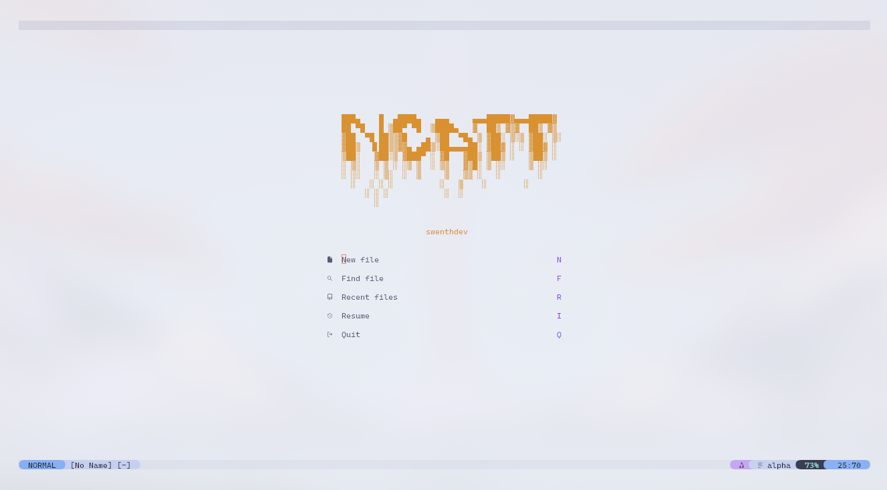
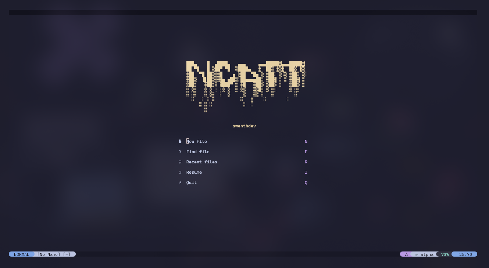
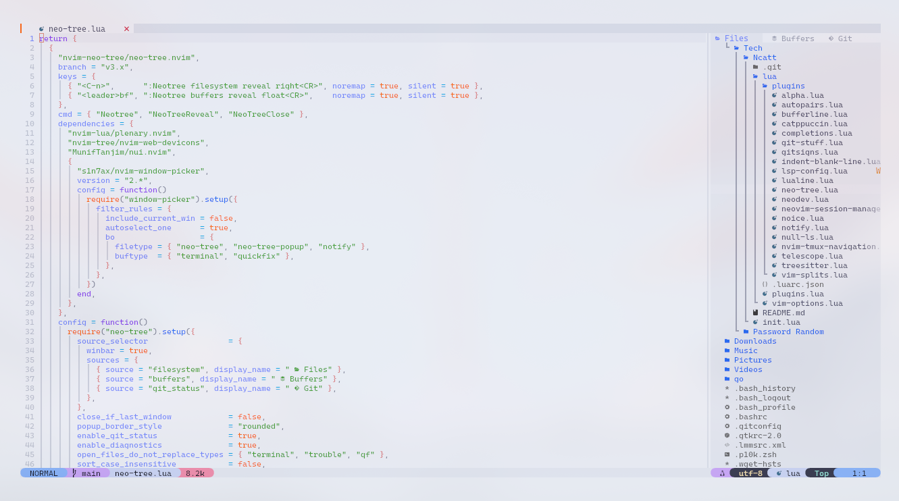
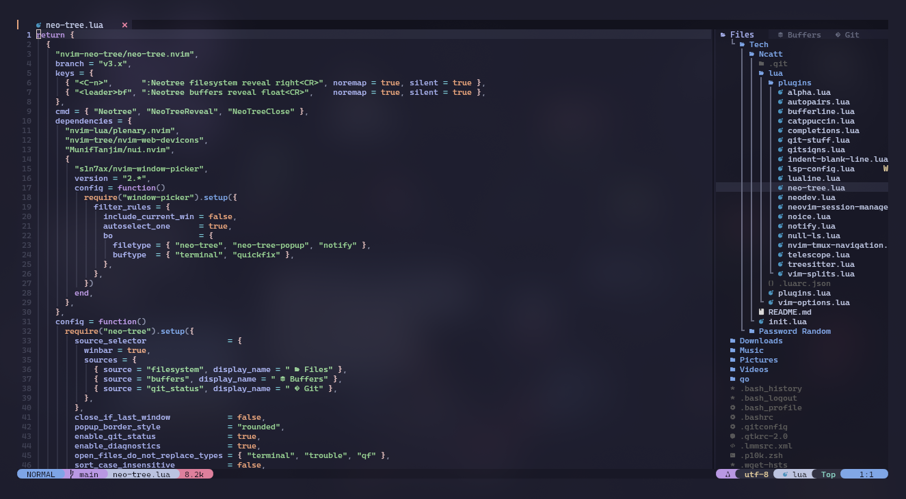
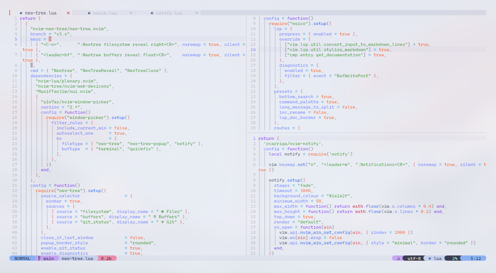
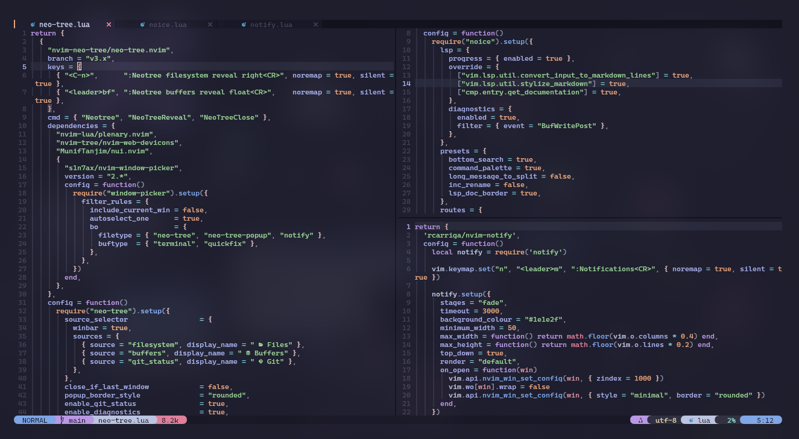

# 🧠 Ncatt

> Neovim configuration in Lua using `lazy.nvim`.

[**English**](#english) | [**Español**](#espanol)

---

## English

### ✨ Overview

**Ncatt** is a modular Neovim setup built in **Lua** with **`lazy.nvim`**.
It is focused on a clean UI, LSP, Telescope, Neo-tree, Treesitter, Git tools, and a Catppuccin-based visual style.

### 📸 Screenshots

<p align="center">
  
  
  <br />
  
  
  <br />
  
  
</p>

### ⚙️ Current baseline

- Recommended Neovim version: `0.11.3+`
- Plugin manager: `lazy.nvim`
- Lua helper: `lazydev.nvim`
- External tools: `git`, `node`, `npm`

### 🚀 What was refreshed

- Updated the Lua development helper from `neodev.nvim` to `lazydev.nvim`
- Fixed the modern LSP flow with `vim.lsp.config()` + `vim.lsp.enable()`
- Removed a duplicate Git plugin definition

### 📁 Main structure

- `init.lua`: bootstraps `lazy.nvim` and starts the config
- `lua/vim-options.lua`: core editor options and base keymaps
- `lua/plugins/`: one file per plugin or feature area
- `docs/HOW_NCATT_WORKS.md`: simple explanation of how Ncatt works

### 🛠️ Installation

```bash
git clone https://github.com/swenthdev/Ncatt.git ~/.config/nvim
nvim
```

Then run `:Lazy sync` if needed.

### 📚 Extra notes

- Images live in [`imgs/`](/home/swenthdev/Documents/Tech/Ncatt/imgs)
- Project guide: [`docs/HOW_NCATT_WORKS.md`](/home/swenthdev/Documents/Tech/Ncatt/docs/HOW_NCATT_WORKS.md)

### 📝 License

This project is licensed under the **Ncatt Personal Use License v1.0**.
See `LICENSE.txt` for details.

---

## Español

### ✨ Resumen

**Ncatt** es una configuración modular de Neovim hecha en **Lua** con **`lazy.nvim`**.
Está enfocada en una interfaz limpia, LSP, Telescope, Neo-tree, Treesitter, herramientas Git y una apariencia basada en Catppuccin.

### 📸 Capturas

<p align="center">
  
  
  <br />
  
  
  <br />
  
  
</p>

### ⚙️ Base actual

- Versión recomendada de Neovim: `0.11.3+`
- Gestor de plugins: `lazy.nvim`
- Ayudante para Lua: `lazydev.nvim`
- Herramientas externas: `git`, `node`, `npm`

### 🚀 Qué se actualizó

- Se cambió `neodev.nvim` por `lazydev.nvim`
- Se corrigió el flujo LSP moderno con `vim.lsp.config()` + `vim.lsp.enable()`
- Se eliminó una definición duplicada de plugins Git

### 📁 Estructura principal

- `init.lua`: inicializa `lazy.nvim` y arranca la config
- `lua/vim-options.lua`: opciones base del editor y atajos principales
- `lua/plugins/`: un archivo por plugin o área funcional
- `docs/HOW_NCATT_WORKS.md`: explicación simple de cómo funciona Ncatt

### 🛠️ Instalación

```bash
git clone https://github.com/swenthdev/Ncatt.git ~/.config/nvim
nvim
```

Luego ejecuta `:Lazy sync` si hace falta.

### 📚 Notas extra

- Las imágenes están en [`imgs/`](/home/swenthdev/Documents/Tech/Ncatt/imgs)
- Guía del proyecto: [`docs/HOW_NCATT_WORKS.md`](/home/swenthdev/Documents/Tech/Ncatt/docs/HOW_NCATT_WORKS.md)

### 📝 Licencia

Este proyecto está licenciado bajo la **Ncatt Personal Use License v1.0**.
Revisa `LICENSE.txt` para más detalles.
